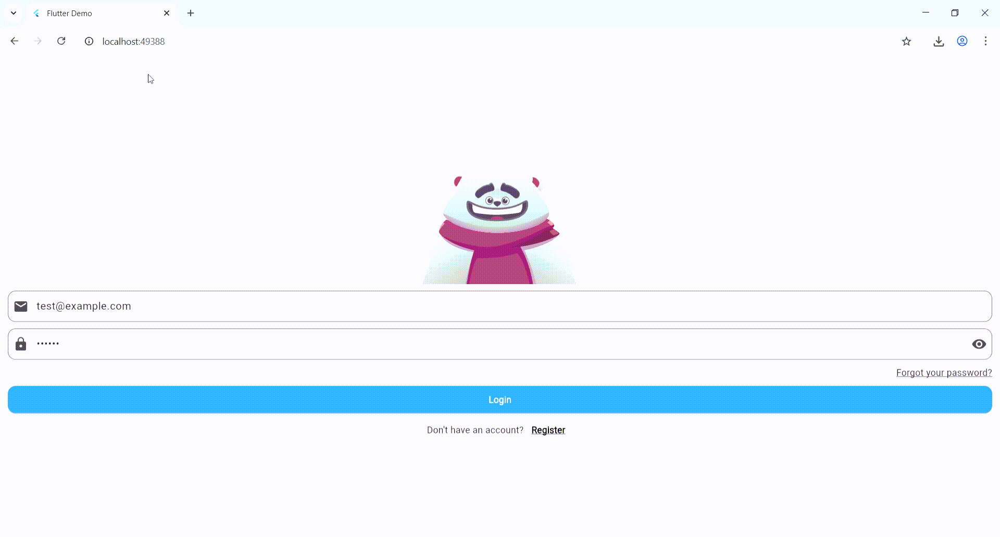

# login_animation_pro_8sc

A new Flutter project.

## Getting Started

This project is a starting point for a Flutter application.

A few resources to get you started if this is your first Flutter project:

- [Lab: Write your first Flutter app](https://docs.flutter.dev/get-started/codelab)
- [Cookbook: Useful Flutter samples](https://docs.flutter.dev/cookbook)

For help getting started with Flutter development, view the
[online documentation](https://docs.flutter.dev/), which offers tutorials,
samples, guidance on mobile development, and a full API reference.

# 📱 Login Animation with Flutter + Rive

Project developed as part of the course **Mobile Application Programming** at the **Instituto Tecnológico de Mérida**.  
This project implements an **animated login system**, using **Flutter**, **Dart**, and the **Rive** library to add interactive visuals.

---

## 🚀 Main Features
- **Rive login animation**:
  - The character follows the email text while typing ✉️  
  - Covers its eyes when entering the password 🔒  
  - **Smiles on successful login ✅**  
  - **Gets angry/sad on failed login ❌**
- Input fields for **Email** and **Password**.  
- Action buttons for:
  - **Login**
  - **Register**
  - **Forgot Password**
- Responsive design with **Material Design**.  

---

## ⚙️ Environment Setup

### 1. Install Flutter & Dart
1. Download and install [Flutter](https://docs.flutter.dev/get-started/install).  
2. Install **Visual Studio Code** and the **Flutter extension**.  
3. Make sure **Git** is installed and configured.  
4. Verify installation with:
   ```bash
   flutter doctor -v


### 2. Add Rive
1. Go to pub.dev - Rive package.
2. Copy the installation command and add it to your project.
3. Flutter will automatically add the dependency to pubspec.yaml.

---

## 📂 Project Structure
```bash
lib/
 ├── main.dart              # Application entry point
 └── screens/
     └── login_screen.dart  # Login screen

assets/
 └── login_animation.riv    # Rive animation asset

test/                       # Automated tests
pubspec.yaml                # Dependencies and configuration

## 🖼️ UI Overview
- **Login animation**: interactive bear linked to the text fields.
- **Email field**: with eye-following animation.
- **Password field**: with hands-covering-eyes animation.
- **Login button**: triggers happy/sad animations based on validation.



---

## 🔗 Repositories
- [Leonardo’s Repository](https://github.com/LeoOrtizV/login_animation_pro_8sc)  

---

## 📝 Conclusions
> “Implementing Flutter with Rive allowed us to understand how **State Machine Inputs (SMI)** control animations and interactions, reinforcing practical learning in mobile development.”  

---

## 🎨 Animation Credit

Login animation remix: [“Login Machine / Remix of Login Machine”](https://rive.app/marketplace/3645-7621-remix-of-login-machine/) on Rive Marketplace
Created by **Ruksar Ahmed** on Rive Marketplace. 

Adapted and implemented for this project by *Programación de Aplicaciones Móviles*, Instituto Tecnológico de Mérida.

---

